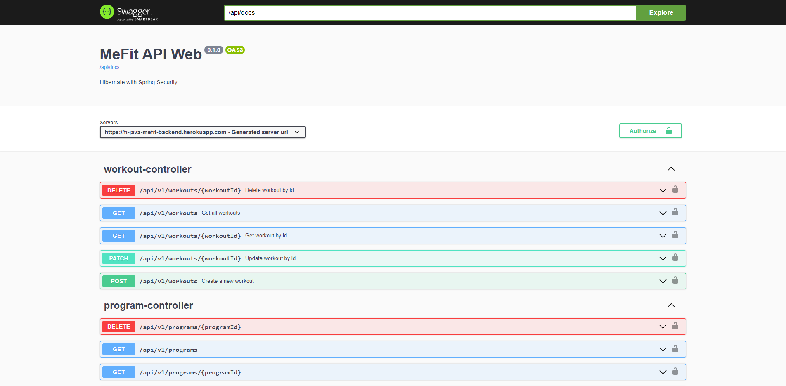

# Me-Fit Backend

[](https://github.com/RichardLitt/standard-readme)
[](https://movie-app-2022.herokuapp.com/swagger-ui/index.html)

Noroff Case Study

- [PostgreSQL](https://www.postgresql.org/) database using [Hibernate](https://hibernate.org/)
- [Spring](https://spring.io/) Web API to access endpoints, which are exposed and documentation provided by [Swagger](https://swagger.io/) OpenAPI
- Access Management with [Keycloak](https://www.keycloak.org/)
- [Docker](https://www.docker.com/) image deployed on [Heroku](https://www.heroku.com/)



## Table of Contents

- [Security](#security)
- [Install](#install)
- [Usage](#usage)
- [API](#api)
- [Maintainers](#maintainers)
- [Contributing](#contributing)
- [License](#license)

## Security

Security layer added to app.

- Keycloak access management is handling logging and registering of users
- Authentication is done with an access token that must be sent with each API request
- Some endpoints are also accessible only to certain roles

## Install

Clone
```
https://github.com/Azruim/MeFit-backend.git
```

## Usage

Run locally with IDE of your choice (IntelliJ is great!)

## API

Database for:
- MeFit Frontend

Swagger OpenAPI providing more info.

Swagger Endpoint:
- ../api/docs

[Heroku Deployment](https://fi-java-mefit-backend.herokuapp.com/api/docs)

## Maintainers

[@Nico Behnen](https://github.com/azruim)  
[@Julius Huttunen](https://github.com/juliushuttunen)  
[@Sasu Korhonen](https://github.com/bgf122)  
[@Teemu Näsänen](https://github.com/teemunasanen)

## Contributing

PRs accepted.

Small note: If editing the README, please conform to the [standard-readme](https://github.com/RichardLitt/standard-readme) specification.

## License

MIT © 2022 Nico Behnen & Julius Huttunen & Sasu Korhonen & Teemu Näsänen
